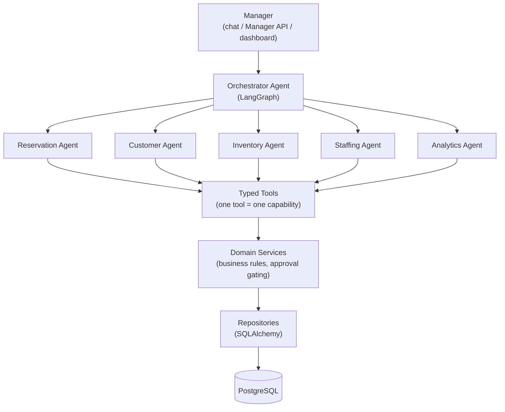
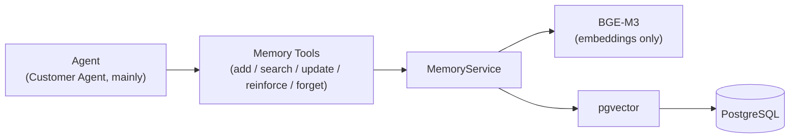
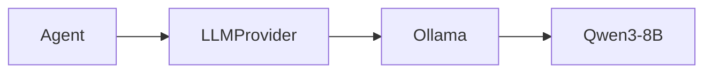
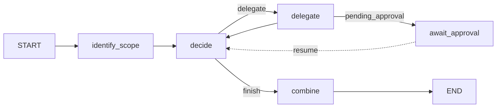
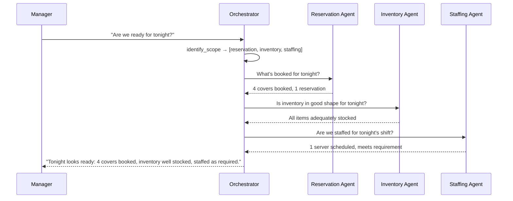
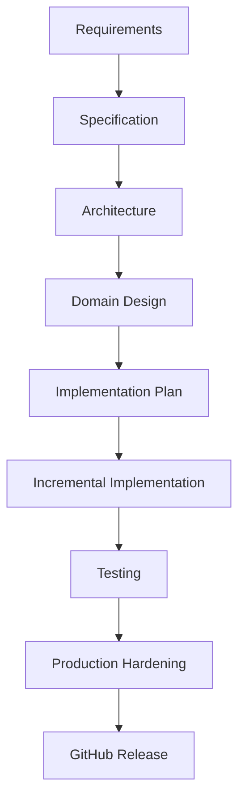

# Restaurant Sahayak

**An agentic AI restaurant operations platform, built spec-driven** — planned and
specified before any code was written, then implemented in sequential, documented
steps (see [Spec-Driven Development](#spec-driven-development) and
[docs/DEVELOPMENT_ROADMAP.md](docs/DEVELOPMENT_ROADMAP.md)). A restaurant manager talks
to a chat-style Orchestrator Agent, which reasons about the request and delegates it to
the right specialist agent(s) — Reservation, Customer, Inventory, Staffing, or
Analytics — each of which acts on the system exclusively through typed tools, never
through raw SQL or document retrieval.

## Table of contents

- [Problem and motivation](#problem-and-motivation)
- [What Restaurant Sahayak does](#what-restaurant-sahayak-does)
- [Architecture](#architecture)
- [Model architecture](#model-architecture)
- [Persistent memory vs. RAG](#persistent-memory-vs-rag)
- [Human approval](#human-approval-for-high-impact-actions)
- [Event-driven and autonomous workflows](#event-driven-and-autonomous-workflows)
- [Observability](#observability)
- [Testing](#testing)
- [Setup](#setup)
- [Examples](#examples)
- [Limitations](#limitations)
- [Future roadmap](#future-roadmap)
- [Project structure](#project-structure)
- [Spec-Driven Development](#spec-driven-development)
- [How this project was built](#how-this-project-was-built)

## Problem and motivation

A restaurant manager's day is a stream of small, cross-cutting questions — "are we
ready for tonight?", "do we have enough olive oil for the weekend?", "what should I
know about this customer before I seat them?" — each of which actually spans several
separate systems (the reservation book, stock levels, the staff schedule, a customer's
history) that don't talk to each other. Answering any one of them well means checking
multiple places and remembering context (a regular's seating preference, a recurring
supplier issue) that no single screen holds.

Restaurant Sahayak explores what that experience looks like if a manager can just ask, in plain
language, and have a coordinated set of AI agents go check the actual operational data,
reason about what matters, remember relevant context across conversations, and — for
anything with real consequence — come back for a human decision rather than act
unilaterally.

**Why this matters for the business**: every specialist here maps to something that
affects the bottom line directly, not abstractly. The Analytics Agent surfaces real
revenue, covers, and item-sales numbers on demand instead of buried in a report nobody
opens. The Inventory Agent catches a stockout before it becomes a lost sale or a
mid-service substitution the guest didn't want. The approval system gates high-cost
purchases and large cancellations so spend stays under real oversight instead of
happening automatically. The Staffing Agent matches scheduled labor to actual expected
demand, which is the difference between overstaffing (pure cost) and understaffing
(worse service, and eventually fewer repeat guests). None of this is a claim that
Restaurant Sahayak runs the restaurant for you — it's that the manager-facing decisions
it speeds up and grounds in real data are genuine, direct inputs to running the
operation more efficiently, which is the concrete path to protecting and growing
revenue. Being precise about what this is *not*: it does not manage a live waitlist or
track table-turnover/kitchen-ticket time, so any story about *customer-facing wait time*
specifically stays indirect (see [Limitations](#limitations)) — the efficiency and
revenue story above is the direct one.

## What Restaurant Sahayak does

- **Chat-style requests, correctly routed.** The manager (or the API) sends one
  natural-language task to the Orchestrator; it works out which specialist domain(s)
  are actually required, delegates to each in turn, and combines their results into one
  answer.
- **Five specialist agents**, each scoped to one operational domain and a fixed set of
  typed tools:
  - **Reservation** — view/create/modify/cancel reservations, find available tables.
  - **Customer** — customer profiles, visit history, and persistent preferences/notes
    via memory.
  - **Inventory** — stock levels, shortage checks, purchase requests.
  - **Staffing** — shift schedules, staff availability, requirement calculations.
  - **Analytics** — sales, top items, no-show rate, from existing structured data only.
- **Persistent memory** that survives across conversations — a customer's seating
  preference stated once is recalled the next time it's relevant, without re-asking the
  manager.
- **Human approval gates** for actions with real operational or financial consequence
  (a large-party cancellation, a costly purchase request) — the agent proposes, a
  manager decides.
- **Event-driven reactions** — a reservation being created, or stock dropping below
  threshold, can trigger an agent workflow on its own, not only in response to a chat
  message.
- **Autonomous background workflows** — a daily briefing, and periodic reservation/
  inventory/staffing monitoring, run on a schedule without a manager asking.
- **Full observability** — every agent run, tool call, LLM call, memory operation,
  event, and approval decision is traced (OpenTelemetry) and viewable per-request as a
  nested trace (Orchestrator → Specialist → Tool → Result) in the built-in dashboard.

## Architecture

Restaurant Sahayak enforces one strict layering rule everywhere: agents and tools never see
PostgreSQL, SQLAlchemy, or a raw SQL query. This is not just convention — it's checked
by `tests/unit/test_layer_boundaries.py`, which fails if `app.agents` or `app.tools`
imports `sqlalchemy`, `app.models`, or `app.repositories`.



**Memory subsystem** (a separate path from domain data — agents reach it only through
its own typed tools, never mixed with `Tools` above):



**LLM path** (reasoning and tool-calling, entirely separate from the embedding path
above):



Every specialist agent is a `ToolCallingAgent` subclass: a small hand-rolled
generate → maybe-call-a-tool → generate loop. The Orchestrator is the one agent built
on **LangGraph** instead, because coordinating other agents (decide who's needed,
delegate, decide if someone else is now needed, loop, combine, possibly pause for a
human decision) is a genuinely graph-shaped control problem, not a flat loop. Its graph:



`identify_scope` runs once per request: a real LLM call that decides which specialist
domains are actually essential to this specific request (not a hardcoded rule). `decide`
then deterministically enforces that no domain marked essential can be skipped — it
still asks the LLM what to do next each turn, but if the LLM tries to finish before
every required domain has been consulted, the orchestrator overrides it and forces the
next missing delegation. This keeps the actual reasoning (which specialist to send,
what to tell it, when the answer is complete) inside the LLM, while making the *shape*
of coverage for a given request a guarantee rather than a hope.

## Model architecture

| Component | Role |
|---|---|
| **Qwen3-8B** (via Ollama) | Reasoning and tool-calling for every agent — the Orchestrator's routing decisions and every specialist's tool selection and final answers. |
| **BGE-M3** (`BAAI/bge-m3`, via `sentence-transformers`) | Embeddings for `MemoryService` only. Never used for reasoning, never sees a prompt — it turns a memory's text into a vector and turns a search query into a vector, nothing else. |
| **LangGraph** | Orchestration and state for the Orchestrator Agent only (decide/delegate/await-approval/combine graph, with pause/resume for human approval). Specialist agents use a simpler hand-rolled tool-calling loop, not LangGraph. |
| **PostgreSQL + pgvector** | The single database for both application data (reservations, customers, inventory, staff, sales, ...) and the `memories` table's vector column. One database, two kinds of content, one repository layer. |

**Restaurant Sahayak does NOT use RAG.** There is no document ingestion, no chunking, no
document-retrieval pipeline, and no vector search over unstructured text anywhere in
this codebase. This is a non-negotiable project principle — see
[`.specify/memory/constitution.md`](.specify/memory/constitution.md), Principle II.

## Persistent memory vs. RAG

It's easy to conflate these because both involve embeddings and a vector column — the
difference is what's being stored and retrieved, and why:

| | RAG | Restaurant Sahayak's persistent memory |
|---|---|---|
| **What's stored** | Chunks of unstructured documents | Structured facts: one `Memory` row = one typed fact (a customer preference, a business rule, a past decision, ...), with a `memory_type`, `topic`, `source`, `importance`, and `confidence` |
| **Why embeddings exist** | To retrieve relevant *document text* to stuff into a prompt as unstructured context | To find relevant *facts by meaning* rather than exact keyword/topic match — a narrower, specific use of semantic similarity |
| **Who writes it** | An ingestion pipeline processing external documents | An agent, explicitly, via a typed `add_memory` tool call — memory is asserted, not scraped |
| **Lifecycle** | Re-index when documents change | Deduplication on exact `(restaurant, type, scope, topic)` conflict (a re-stated fact supersedes the old one), reinforcement (confidence increases on repeated confirmation), and forgetting (soft-delete, audit-preserving) — see `app/services/memory_service.py` |
| **What the agent gets back** | Raw document text to read and summarize | A structured fact plus a similarity score, ready to reason over directly |

In short: RAG retrieves *documents*; Restaurant Sahayak's `MemoryService` retrieves *facts the
system was explicitly told*, semantically, from a store of structured records. No
document ever enters this pipeline.

## Human approval for high-impact actions

Some actions carry real operational or financial consequence, and Restaurant Sahayak does not let
an agent execute those unilaterally. Each domain service (not the agent, not the tool)
decides whether an action is high-impact, based on concrete, configurable thresholds:

- **Reservation** — cancelling or modifying a reservation with `party_size >=
  RESERVATION_HIGH_IMPACT_PARTY_SIZE` (default `6`) requires approval; smaller parties
  execute immediately.
- **Inventory** — a purchase request with `estimated_cost >=
  PURCHASE_REQUEST_HIGH_IMPACT_COST_THRESHOLD` (default `200.0`) requires approval.

When a threshold is crossed, the service calls `ApprovalService.create_approval_request`
with a `risk_level` of `MEDIUM` or `HIGH` instead of performing the action, and the tool
returns a `pending_approval` result instead of a normal one. If the request came in
through the Orchestrator, the whole LangGraph run genuinely pauses (LangGraph's
`interrupt()`) and returns `status="pending_approval"` — it resumes only once a manager
calls `approve()` or `reject()` through the Manager API, which is also the only code
path that ever actually executes the pending action.

## Event-driven and autonomous workflows

Two separate mechanisms trigger agent work without a manager typing a chat message:

- **Event-driven (reactive).** Domain services publish typed events
  (`reservation.created`, `inventory.low`, `staffing.shortage_detected`, ...) through an
  in-process `EventBus`. Subscribed workflow handlers react — e.g.
  `handle_reservation_created` asks the `InventoryAgent` to check whether the new
  covers can be supported. Publishing never raises because a handler failed: each
  handler is isolated and retried independently, and its outcome is recorded on the
  `Event` row.
- **Autonomous (scheduled).** Four `BackgroundWorkflow`s run on a fixed interval via a
  minimal in-process `AsyncIOScheduler`: a daily briefing (delegates through the full
  Orchestrator), and periodic reservation/inventory/staffing monitoring (call one
  specialist agent directly). Every run and its outcome is recorded as a
  `WorkflowRun`, visible in the dashboard.

Both mechanisms are deliberately documented, not hidden, as MVP-scale choices: the
`EventBus` is synchronous in-process dispatch (no external broker), and the scheduler is
fixed-interval, not calendar-aware. Both are built behind small interfaces
(`app/services/event_bus.py`, `app/workflows/scheduler.py`) specifically so a production
deployment could swap in a real broker/durable scheduler without changing any
publisher, handler, or workflow.

## Observability

Every agent run, tool call, LLM call, memory operation, event, approval decision, and
background workflow run is traced with OpenTelemetry, and every log line carries a
correlation id (`app/core/logging.py`, `app/core/telemetry.py`). The Manager
dashboard's Agent Activity view renders the resulting trace as a tree: Orchestrator →
Specialist Agent → Tool → Result.

By default (`OTEL_EXPORTER=console`) spans print to stdout — no extra infrastructure
required. To browse them in Jaeger's UI instead:

```bash
docker compose -f docker/docker-compose.observability.yml up -d
# then in .env: OTEL_EXPORTER=otlp, OTEL_EXPORTER_OTLP_ENDPOINT=http://localhost:4318
```

Open http://localhost:16686 once the app or a workflow has run.

## Testing

329 tests across `tests/unit/` (27 files) and `tests/integration/` (37 files):

- **Unit tests** — orchestrator graph wiring, tool logic, service business rules —
  against scripted LLM responses and no real database.
- **Integration tests** (non-`*_live.py`) — real Postgres + pgvector, scripted LLM
  responses, real specialist agents and services. Covers the full delegation chain,
  approval pause/resume, event workflows, and the Manager API.
- **Live-model tests** (`*_live.py`) — the same scenarios against a real running Qwen3-8B
  (Ollama) and real BGE-M3, proving actual model behavior, not just wiring. Excluded
  from CI (no GPU/model runner available there) and from a plain `-k "not live"` local
  run; run them locally against a real Ollama instance.

```bash
uv run pytest                       # everything, including live-model tests
uv run pytest -k "not live"         # fast: unit + integration, no real LLM/embeddings
uv run pytest tests/unit            # unit only
```

CI (`.github/workflows/ci.yml`) runs ruff (lint + format check), mypy, the non-live test
suite against a real `pgvector/pgvector:pg16` Postgres service container, and a Docker
build verification, on every push to `main` and every pull request.

## Setup

### Prerequisites

- Python 3.12+ (repo pins 3.13 via `.python-version`)
- [`uv`](https://docs.astral.sh/uv/) for dependency management
- PostgreSQL 16 with the `pgvector` extension (the `pgvector/pgvector:pg16` Docker image
  provides this; plain `postgres:16` does not)
- [Ollama](https://ollama.com), running locally, with `qwen3:8b` pulled
- ~2GB free for the BGE-M3 model, which `sentence-transformers` downloads on first use

### Installation

```bash
git clone https://github.com/metylerdurden/RestaurantSahayak.git
cd RestaurantSahayak
uv sync
```

### Environment variables

```bash
cp .env.example .env
```

`.env.example` documents every variable Restaurant Sahayak reads (`app/core/config.py`):
`DATABASE_URL`, `LLM_PROVIDER`/`LLM_MODEL`/`OLLAMA_BASE_URL`, `EMBEDDING_PROVIDER`/
`EMBEDDING_MODEL`/`EMBEDDING_DEVICE`, `OTEL_*` tracing settings, and an optional
`API_KEY` (see [`app/api/security.py`](app/api/security.py) — unset by default for
local development; set it before exposing the API beyond your own machine).

### PostgreSQL + pgvector

```bash
docker run -d --name dineops-postgres \
  -e POSTGRES_DB=dineops -e POSTGRES_USER=dineops -e POSTGRES_PASSWORD=dineops_dev_password \
  -p 5432:5432 pgvector/pgvector:pg16
```

(Or use `docker compose -f docker/docker-compose.yml up -d postgres` — see
[Docker](#docker) below.)

### Ollama + Qwen3-8B

```bash
ollama pull qwen3:8b
ollama serve   # if not already running
```

BGE-M3 needs no separate install — `sentence-transformers` downloads and caches
`BAAI/bge-m3` automatically the first time an embedding is requested.

### Migrations and seed data

```bash
uv run alembic upgrade head
uv run python -m scripts.seed     # idempotent — one realistic restaurant's worth of data
```

### Local development

```bash
uv run uvicorn app.main:app --reload
```

Open http://localhost:8000/ for the Manager dashboard (reservations, inventory,
customers, approvals, Agent Activity trace viewer, manual workflow triggers — no build
step, static files served from `app/static/`).

Verify the LLM and embedding providers are actually reachable:

```bash
uv run python scripts/verify_providers.py
```

### Docker

```bash
docker compose -f docker/docker-compose.yml up -d
```

Brings up Postgres (with pgvector) and the API container. Ollama and BGE-M3 are
**not** containerized — the API container reaches Ollama on the host via
`http://host.docker.internal:11434`, and BGE-M3 loads inside the API container itself
via `sentence-transformers` on first use. Both must be available (Ollama running on the
host, or the model already cached) for the containerized API to answer agent requests.

### Tests

```bash
uv run pytest                # everything (needs Ollama + BGE-M3 for *_live.py tests)
uv run pytest -k "not live"  # everything else — needs Postgres, not a real LLM
```

Tests run against a dedicated `dineops_test` database, never the `dineops` dev database
(`tests/conftest.py` overrides `DATABASE_URL`).

## Examples

### Example 1 — "Are we ready for tonight?"

A broad readiness question. The Orchestrator's scope step recognizes this spans the
whole operation and requires Reservation, Inventory, and Staffing (at minimum); its
decide loop then guarantees all three are consulted before it can finish, regardless of
what each individual specialist call turns up:



### Example 2 — Persistent memory across conversations

First conversation, a fact is recorded:

> "Raj prefers quiet seating away from the kitchen."

The Customer Agent calls its `add_memory` tool — a `CUSTOMER_PREFERENCE` memory,
embedded via BGE-M3, and persisted.

A later, separate conversation:

> "Raj is coming Friday at 8."

```mermaid
sequenceDiagram
    participant M as Manager
    participant O as Orchestrator
    participant C as Customer Agent
    participant Mem as MemoryService
    participant R as Reservation Agent

    M->>O: "Raj is coming Friday at 8. What should I know before seating him?"
    O->>C: preserve full intent — check preferences/notes for Raj
    C->>Mem: search_memory("Raj seating preferences")
    Mem-->>C: "Raj prefers a quiet table away from the kitchen" (similarity match)
    C-->>O: Raj Patel — prefers a quiet table away from the kitchen
    O->>R: Book Raj Friday 8pm; he prefers a quiet table away from the kitchen
    R-->>O: Booked, quiet table assigned
    O-->>M: "Booked Raj a quiet table, away from the kitchen, for Friday at 8pm."
```

The preference influences the actual table assignment because the Orchestrator passes
the recalled fact — not just "look up Raj" — into the instruction it gives the
Reservation Agent.

### Example 3 — Inventory shortage

A manager (or a `reservation.created` event) asks the Inventory Agent to check stock.
The agent calls `check_stock`; if a required quantity exceeds what's on hand, the tool
reports the shortfall directly rather than silently failing, and the agent can then call
`calculate_required_inventory` to size a purchase and `create_purchase_request` to
propose one — which, if the estimated cost crosses the high-impact threshold, comes back
as a `pending_approval` result instead of executing.

### Example 4 — Human approval

> "Cancel the reservation for the party of 12."

Party size (`12`) is at or above `RESERVATION_HIGH_IMPACT_PARTY_SIZE` (default `6`), so
`ReservationService.cancel_reservation` does not cancel it — it calls
`ApprovalService.create_approval_request(risk_level="MEDIUM", ...)` instead. The tool
returns `pending_approval`; if this came through the Orchestrator, the whole LangGraph
run pauses (`status="pending_approval"`, an `awaiting_approval_id`) rather than reporting
a false completion. The manager reviews it in the dashboard's Approvals view and calls
approve or reject; only that decision — via `ApprovalService.approve()`/`reject()` —
actually executes (or discards) the cancellation, and the Orchestrator run resumes from
exactly where it paused.

## Limitations

Documented honestly, not hidden:

- **No user-account/auth system.** There's a single implicit manager role and no
  login; `app.models.user.User` exists but authentication was explicitly out of scope
  for the Core Platform MVP. `app/api/security.py` adds an optional shared-secret
  (`X-API-Key`) boundary, not real per-user auth.
- **Single restaurant, single manager role, five fixed specialist domains.** This is
  the MVP scope from `specs/001-core-platform-mvp/spec.md`, not a current limitation of
  the architecture — the layering would support more, but no multi-tenant or
  multi-role code exists yet.
- **In-memory LangGraph checkpointer.** Orchestrator pause/resume state
  (`InMemorySaver`) does not survive an app restart — a pending approval created just
  before a restart would lose its paused graph state (the `Approval` row itself is
  durable in Postgres; only the paused LangGraph execution is not).
- **In-process, synchronous EventBus; fixed-interval, non-calendar-aware scheduler.**
  No external message broker and no "every morning at 7am"-style triggers — documented
  as deliberate MVP tradeoffs in `app/services/event_bus.py` and
  `app/workflows/scheduler.py`, built behind interfaces that would allow swapping in a
  production broker/scheduler later without touching callers.
- **Ollama and BGE-M3 are not containerized.** `docker compose up` brings up Postgres
  and the API only; Qwen3-8B (via Ollama) and BGE-M3 must be available on the host.
- **Live-model tests are occasionally flaky**, by nature of testing a real LLM's
  behavior rather than mocked wiring — e.g. `AnalyticsAgent`'s live test has been
  observed to intermittently fail a single run (empty tool output) and then pass on
  immediate reruns. This reflects real Qwen3-8B nondeterminism on some prompts, not a
  wiring bug; it is not currently mitigated beyond the bounded LLM-call retry already in
  `app/llm/ollama_provider.py`.
- **No horizontal scaling story.** One AsyncSession per request, an in-process event
  bus and scheduler, and an in-memory graph checkpointer all assume a single running
  instance.

## Future roadmap

Reasonable next steps — **not implemented**, listed as direction, not current state:

- Real authentication/authorization (per-user identity, sessions, roles beyond a
  single implicit manager).
- Multi-restaurant / multi-tenant support.
- A durable LangGraph checkpointer (Postgres-backed) so pending approvals survive a
  restart.
- A production message broker behind the existing `EventBus` interface, and a
  calendar-aware scheduler behind the existing `Scheduler` interface.
- Additional specialist agents or tools within existing domains (e.g. menu management,
  supplier communication) — via the same typed-tool pattern, not a departure from it.
- Streaming agent responses to the dashboard instead of request/response.

If a *direct* customer-facing wait-time story (rather than the indirect one described
above) is worth pursuing on top of the efficiency/revenue focus, the following would
actually move it (none of this exists today — genuinely new domains, not a relabeling
of what's already built):

- A live waitlist/queue agent — walk-ins, estimated seating time, notify-when-ready.
- Table-turnover prediction from historical `Reservation`/`Sale` data, feeding a real
  "next available table" estimate instead of static reservation slots.
- Reservation pacing that accounts for average table-turn time when accepting a booking
  for a given slot, rather than treating every slot as independent.
- Kitchen ticket-time tracking (requires a POS/KDS data source this project doesn't
  have yet) correlated with the Staffing Agent's own requirement predictions, to flag
  *why* a night is running slow, not just that it is.

## Project structure

```
app/
  agents/        Orchestrator + 5 specialist agents, prompts, shared agent state/loop
  api/           FastAPI routes, request/response schemas, auth boundary, app wiring
  core/          Settings, DB session, logging, OpenTelemetry setup
  domain/        Domain-level shared types
  embeddings/    EmbeddingProvider interface + BGE-M3 implementation
  llm/           LLMProvider interface + Ollama implementation
  memory/        (package init — see app/services/memory_service.py for the subsystem)
  models/        SQLAlchemy ORM models
  repositories/  Data-access layer — the only code that talks to SQLAlchemy/Postgres
  schemas/       Pydantic request/response/event schemas
  services/      Domain business logic, approval gating, MemoryService, EventBus
  static/        Manager dashboard (plain HTML/CSS/JS, no build step)
  tools/         Typed tool implementations — the only surface agents act through
  workflows/     Event-driven workflow handlers, autonomous BackgroundWorkflows, scheduler
alembic/         Database migrations
docker/          Dockerfile, docker-compose (app+db), docker-compose (observability)
scripts/         seed.py, verify_providers.py, run_workflow.py
specs/           Spec Kit feature spec, plan, research, data model, contracts, tasks
tests/
  unit/          No real database; scripted LLM responses
  integration/   Real Postgres + pgvector; *_live.py files use a real Qwen3-8B/BGE-M3
.specify/        Spec Kit configuration, constitution, templates
```

## Spec-Driven Development

Restaurant Sahayak was developed using a specification-first, incremental engineering
methodology — design and requirements were written down and agreed before code, and
the system was built up in small, independently validated increments rather than as one
large, unstructured coding task:



This approach was used deliberately, for concrete reasons:

- **Reduce architectural drift** — the layered boundary (`Agent → Tool → Service →
  Repository → Database`) and constitution-level constraints (no RAG, human approval
  for high-impact actions) were fixed before implementation, so later steps had a fixed
  contract to build against instead of re-litigating architecture each time.
- **Define requirements before implementation** — what the MVP must do (`spec.md`) was
  written and validated before any technical decision, so scope was a deliberate choice,
  not whatever turned out to be convenient to build.
- **Plan before coding** — the technical design (`plan.md`, `research.md`,
  `data-model.md`) and the task breakdown (`tasks.md`) existed before the first line of
  application code.
- **Separate concerns** — each step touches one layer or one agent at a time (tools
  before agents, one specialist before the next, the orchestrator only once every
  specialist it coordinates already existed).
- **Implement incrementally** — 20 small steps, each buildable and testable on its own,
  instead of a single large change.
- **Validate each stage** — each step shipped with its own tests before the next step
  began building on top of it.
- **Make the engineering process reproducible** — anyone can trace *why* a given piece
  of the system exists back to a specific spec/plan/task artifact or a specific
  numbered step, not just read the final code.

### Genuine Spec Kit usage

The first five steps of this project are genuine [GitHub Spec Kit](https://github.com/github/spec-kit)
artifacts, produced with its actual slash commands
(`/speckit-constitution`, `/speckit-specify`, `/speckit-plan`, `/speckit-tasks`) — not a
description of a process that was merely inspired by it. The real artifacts live in:

- [`.specify/memory/constitution.md`](.specify/memory/constitution.md) — the project
  constitution (`/speckit-constitution`).
- [`specs/001-core-platform-mvp/spec.md`](specs/001-core-platform-mvp/spec.md) — the
  product specification (`/speckit-specify`).
- [`specs/001-core-platform-mvp/plan.md`](specs/001-core-platform-mvp/plan.md),
  [`research.md`](specs/001-core-platform-mvp/research.md),
  [`data-model.md`](specs/001-core-platform-mvp/data-model.md),
  [`contracts/`](specs/001-core-platform-mvp/contracts/) — the technical plan
  (`/speckit-plan`).
- [`specs/001-core-platform-mvp/tasks.md`](specs/001-core-platform-mvp/tasks.md) — a
  12-phase implementation breakdown (`/speckit-tasks`).

From implementation onward, work proceeded as sequential, numbered steps against that
spec and constitution rather than as separate Spec Kit feature cycles per step — see
[docs/DEVELOPMENT_ROADMAP.md](docs/DEVELOPMENT_ROADMAP.md) for exactly how those 12
planned phases map onto the 20 steps actually delivered (including where phases were
split, combined, or folded into another step's commit — documented there without
smoothing over the discrepancies).

## How this project was built

Restaurant Sahayak was not built as one large, unstructured coding task. It was divided into 20
planned, sequential stages — from project initialization and specification, through one
agent at a time, to orchestration, human approval, event-driven and autonomous
workflows, observability, the Manager API/dashboard, and finally this production
hardening and documentation pass. Each stage has a real commit (or, for this final
hardening stage, a set of working-tree changes not yet committed) that can be inspected
directly.

**[docs/DEVELOPMENT_ROADMAP.md](docs/DEVELOPMENT_ROADMAP.md)** is the authoritative
record of that progression: every one of the 20 steps, its objective, the actual
engineering decisions made, the technologies involved, its deliverables, its commit
reference, and — critically — an honest implementation status (`IMPLEMENTED` /
`PARTIALLY IMPLEMENTED` / `NOT IMPLEMENTED`) based on inspecting this repository, not on
what was originally planned. As of this writing, Steps 1–19 are fully implemented and
committed; Step 20 (this hardening and documentation pass) is in progress and not yet
committed or pushed.

Read that document if you want to understand **how** Restaurant Sahayak got to its current state,
in what order, and why — this README describes **what** it is now.
